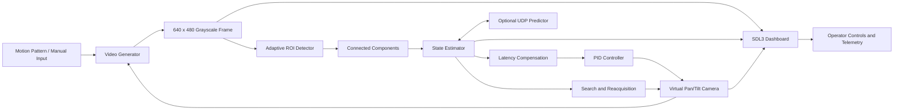
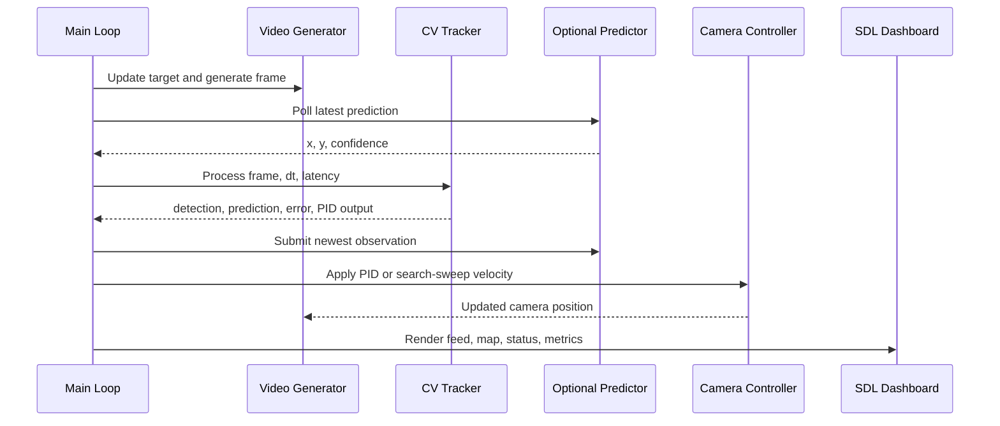

# Orbital Eye / Virtual Camera Tracking

## Technical Documentation for SIH Presentation

**Project type:** Real-time virtual camera tracking simulation  
**Primary language:** C11  
**Interface:** SDL3 desktop dashboard  
**Target platform:** Linux, or Windows through WSL/WSLg  
**Repository:** `SIH26`

---

## 1. Executive Summary

Orbital Eye is a real-time simulation of an intelligent pan/tilt camera tracking a bright target inside a two-dimensional environment. Instead of using a physical camera, the system creates a synthetic grayscale camera feed, injects controlled disturbances, detects the target, estimates its motion, and moves a virtual camera to keep the target near the center of the frame.

The system demonstrates the main building blocks of an automated visual tracking system:

- Synthetic sensor and environment modeling
- Image disturbance and noise simulation
- Bright-object detection
- Connected-component filtering for noise rejection
- Motion estimation and short-term prediction
- Latency compensation
- PID-style camera control
- Target-loss handling and search/reacquisition
- Optional asynchronous external prediction
- Imported video playback through an FFmpeg frame stream
- Real-time rendering, interaction, and profiling

The design is intentionally modular. The synthetic video generator can later be replaced by a webcam, recorded video, or another sensor source while keeping the tracker and controller interfaces largely unchanged.

---

## 2. Problem Statement

A moving target can leave the camera field of view because of target motion, camera latency, image noise, atmospheric interference, or actuator speed limits. A useful tracking system must therefore do more than detect the target in one frame.

Orbital Eye addresses the following questions:

1. How can a target be detected reliably in a noisy grayscale image?
2. How can the target position be estimated between two observations?
3. How can controller latency be compensated?
4. What should happen when the target is temporarily invisible?
5. How can the camera search for and reacquire a lost target?
6. How can the complete pipeline be measured and demonstrated in real time?

The system uses a bright beacon as the target. The beacon is rendered into a simulated camera frame, and the tracker attempts to estimate its image position without directly reading the true target coordinates.

---

## 3. System Scope and Coordinate Spaces

The simulation contains two coordinate spaces.

### 3.1 World space

- Size: `2000 x 2000` simulation units
- Contains the true target and the virtual camera
- The camera center is represented by `camera_pan` and `camera_tilt`
- The camera cannot move its center closer than half the frame size to a world boundary

### 3.2 Image space

- Size: `640 x 480` pixels
- Represents the current camera field of view
- Stored as an 8-bit grayscale frame buffer
- The desired target position is the image center: `(320, 240)`

The video generator converts the world position of the target into image coordinates using the current camera position. The tracker only operates on the generated image and its own internal history.

---

## 4. High-Level Architecture



### Main modules

| Module | Responsibility |
|---|---|
| `src/app/main.c` | Application startup, SDL event loop, frame pipeline, camera actuation, search scan, and shutdown |
| `src/types/types.h` | Shared constants, configuration, simulation state, frame buffer, tracker result, and profiler structures |
| `src/video_gen/video_gen.c/.h` | Target motion, manual movement, synthetic image generation, and disturbances |
| `src/video_source/video_source.c/.h` | SDL file picker, FFmpeg decoding, frame conversion, looping, and live-mode switching |
| `src/cv_tracker/cv_tracker.c/.h` | Target detection, motion estimation, prediction, confidence, PID control, and target-loss state |
| `src/renderer/renderer.c/.h` | SDL3 dashboard, world map, feed display, overlays, fonts, icons, and telemetry |
| `src/gui/gui.c/.h` | Sliders, toggles, checkboxes, buttons, dropdowns, and mouse-coordinate handling |
| `src/profiler/profiler.c/.h` | Per-stage timing and rolling performance measurements |
| `src/predictor_bridge/predictor_bridge.c/.h` | Optional non-blocking UDP bridge for an external predictor |
| `tests/test_cv_tracker.c` | Regression tests for tracking, loss, prediction, direction, and reacquisition |
| `Makefile` | Production build, test build, and cleanup commands |

---

## 5. Frame-by-Frame Processing Pipeline

Every application frame follows this sequence:

1. Read SDL events and keyboard input.
2. Apply manual target movement when manual mode is enabled.
3. Update the automatic target trajectory.
4. Generate the current synthetic camera image, or read the next decoded 2000 x 2000 grayscale environment frame from the selected video through FFmpeg.
5. In custom mode, crop the current 640 x 480 camera viewport from that environment using the simulated pan/tilt position. Add configured disturbances only to synthetic frames.
6. Poll the optional external predictor for the newest prediction.
7. Run the C tracker on the current frame.
8. Submit the newest observation or prediction to the optional predictor.
9. Apply PID pan and tilt adjustments.
10. Override the controller with a search sweep when the target has been lost long enough.
11. Clamp the camera position to valid world boundaries.
12. Render the dashboard and telemetry.
13. Record frame and stage timing.



---

## 6. Synthetic Video Generation

### 6.1 Target motion patterns

The target can follow three automatic paths:

- **Linear path:** horizontal movement with sinusoidal vertical movement
- **Circular orbit:** circular motion around the center of the world with a radius of approximately `650` units
- **Random walk:** deterministic pseudo-random movement in both axes

The target is clamped to remain at least 30 world units from each boundary.

### 6.2 Manual target mode

When manual mode is enabled, automatic movement is paused. The target can be moved with:

- Arrow keys
- `W`, `A`, `S`, and `D`

Manual movement is scaled by frame delta time, making it approximately frame-rate independent. This mode is especially useful for deliberately moving the target outside the camera field of view and demonstrating prediction, target loss, and reacquisition.

### 6.3 Background and disturbances

The image background is a low-amplitude mathematical texture generated from sine and cosine functions. The beacon is drawn as an approximately `11 x 11` white square at brightness `255`.

Supported disturbances:

- **Gaussian-style noise:** deterministic signed random variation applied per pixel
- **Haze:** blends the image toward a brighter background level
- **Salt-and-pepper noise:** randomly inserts black and white pixel spikes
- **Platform jitter / noise intensity:** controls disturbance strength and spike count

The random generator is an internal deterministic linear-congruential generator. This makes behavior reproducible during testing and demonstrations without requiring external data. In custom-video mode, noise, haze, and platform jitter controls are disabled because the imported frame is the environment.

### 6.4 Custom video environment

The center toolbar contains `Import`, `Video`, and `Live` controls. `Import` opens the SDL3 native file picker, or the Windows picker when running under WSL, and selects a source file. `Video` activates the selected source, and `Live` returns to the synthetic generator without restarting the application. The selected video is shown as the complete 2000 x 2000 environment in the environment tab, while the camera tab shows the fixed 640 x 480 sensor viewport from it. FFmpeg decodes the source with real-time pacing, converts it to grayscale, scales it into the environment canvas with letterboxing, and loops it when it reaches the end.

---

## 7. Computer Vision and Tracking Method

### 7.1 Brightness threshold

The tracker treats pixels with intensity greater than or equal to `200` as candidate target pixels. This works because the simulated beacon has brightness `255`, while the generated background remains much darker even with normal disturbances.

### 7.2 Connected-component detection

A simple average of all bright pixels is vulnerable to isolated white noise. Orbital Eye instead performs a flood-fill connected-component search:

1. Scan the current search region.
2. Find an unvisited pixel at or above the brightness threshold.
3. Flood-fill its 8-connected neighbors.
4. Count the component pixels and accumulate their coordinates.
5. Keep the largest component.
6. Reject it if it contains fewer than 9 pixels.
7. Return the component centroid as the measurement.

The beacon is large and connected, while salt-and-pepper white noise is usually isolated. This makes the largest-component rule effective for the simulator.

The centroid is calculated as:

$$
 x_c = \frac{1}{N}\sum_{i=1}^{N} x_i,
 \qquad
 y_c = \frac{1}{N}\sum_{i=1}^{N} y_i
$$

where $N$ is the number of pixels in the selected connected component.

### 7.3 Adaptive region of interest

The tracker does not always scan the entire image. It searches an adaptive region of interest (ROI) around the predicted target position.

- Initial ROI radius: `72` pixels
- On successful detection: radius shrinks toward `48` pixels
- On missed detection: radius expands up to `320` pixels
- After repeated misses: a global search is attempted

This reduces unnecessary scanning during normal tracking while still allowing recovery when uncertainty increases.

### 7.4 State estimation

The tracker maintains persistent state:

- Estimated position: `x`, `y`
- Estimated velocity: `velocity_x`, `velocity_y`
- Position and velocity covariance values
- PID integral and previous-error values
- ROI radius
- Frames since last detection
- Preferred horizontal and vertical search directions

Between measurements, position is predicted using constant velocity:

$$
 x_{t+\Delta t} = x_t + v_x\Delta t,
 \qquad
 y_{t+\Delta t} = y_t + v_y\Delta t
$$

When a measurement is available, the position is corrected using a variance-based gain. Velocity is smoothed so that one noisy measurement does not cause an abrupt reversal:

$$
 v_{new} = 0.75v_{old} + 0.25v_{measured}
$$

This is a lightweight estimator inspired by the practical behavior of a constant-velocity filter. It is not a full Kalman filter, but it retains uncertainty-like covariance values and provides the behavior needed by the simulation.

### 7.5 Latency compensation

The previous measured frame duration is used as an approximate latency horizon. The tracker projects the estimated position forward before computing camera error:

$$
 x_{control} = x_{estimate} + v_x \cdot latency
$$

$$
 y_{control} = y_{estimate} + v_y \cdot latency
$$

The predicted position is intentionally allowed to leave the image bounds. Clamping it at the edge would remove the direction of travel when the target exits the frame.

---

## 8. PID-Style Camera Control

The desired target location is the center of the camera frame. The controller error is:

$$
 e_x = x_{predicted} - 320,
 \qquad
 e_y = y_{predicted} - 240
$$

For each axis, the controller calculates:

$$
 u = K_p e + K_i\int e\,dt + K_d\frac{de}{dt}
$$

The default gains are:

| Parameter | Default |
|---|---:|
| $K_p$ | `0.006` |
| $K_i$ | `0.0002` |
| $K_d$ | `0.006` |

The implementation includes practical protections:

- Integral windup clamp: `-400` to `400`
- Pan output clamp: configurable maximum pan speed
- Tilt output clamp: configurable maximum tilt speed
- Small nonzero time step fallback to avoid division by zero

The resulting controller output is converted into camera movement in world coordinates. The camera center is clamped so the complete `640 x 480` field of view remains within the `2000 x 2000` world.

---

## 9. Target Loss, Prediction, and Reacquisition

### 9.1 Tracker states

The dashboard communicates three practical states:

- **Target locked:** a valid connected component was detected
- **Predictive hold:** detection is missing, but the estimator continues projecting the target
- **Search sweep active:** the target has been absent for at least six frames and the camera begins a world scan

Confidence is derived from the number of frames since detection:

$$
 confidence = clamp\left(1 - \frac{frames\_since\_detection}{12}, 0, 1\right)
$$

### 9.2 Direction-aware search

The tracker remembers how the target was moving when it became difficult to observe:

- Horizontal exit direction: left or right
- Vertical exit direction: up or down

The application uses these directions to start the search near the likely exit quadrant. If the target moves diagonally out of view, both axes are retained.

### 9.3 Serpentine full-world sweep

After six missed frames, the search controller takes over:

1. Start in the last reliable direction.
2. Move horizontally across the world.
3. Reverse direction at a horizontal boundary.
4. Move vertically by approximately one camera field height.
5. Continue in alternating rows.
6. Stop immediately when a valid detection returns.

This is a deterministic serpentine scan. It provides bounded, explainable recovery behavior instead of allowing the camera to drift indefinitely.

### 9.4 Optional external predictor

The C tracker can accept a prediction from an external process. A prediction is accepted only when confidence is at least `0.55`.

The accepted prediction:

- Recenters the next ROI search
- Replaces the short-horizon C prediction for control
- Is consumed once, preventing indefinite reuse of stale data

The C estimator always remains the fallback.

The bridge uses non-blocking UDP on `127.0.0.1:47001`:

- C sends the latest observation, sequence number, time step, and latency
- The external process returns predicted `x`, `y`, and confidence
- The C side drains queued responses and keeps the newest valid result

The current workspace contains the C bridge interface, but no `predictor.py` file is present at the time of writing. The README describes a planned or previously used Python predictor with constant-velocity and optional TorchScript behavior. The interface should therefore be treated as optional integration work until that file is restored or added.

---

## 10. SDL3 Dashboard and User Interaction

The SDL3 dashboard provides a live view of the simulation and tracker state.

### Main dashboard views

- **Environment view:** global `2000 x 2000` world, target marker, camera field of view, grid, and tracking status
- **Camera view:** current `640 x 480` grayscale feed with nearest-neighbor scaling
- **Timeline/profile area:** transport-style controls and activity tracks
- **Telemetry panel:** sensor resolution, world size, frame rate, tracking error, confidence, acquisition timing, and active status

### Controls exposed by the UI

- Motion pattern dropdown
- Target mode and shape controls
- Initial target position selector
- Gaussian noise checkbox
- Salt-and-pepper checkbox
- Haze presets: clear, haze, fog
- Platform jitter slider
- Maximum pan speed slider
- Maximum tilt speed slider
- Manual target toggle
- Alignment grid, bounding-box, and error overlays
- Configuration reset button
- Camera/environment view switch
- Fit/100% display options

Keyboard controls:

- `Escape`: exit
- `F11`: toggle fullscreen
- Arrow keys or `WASD`: move the target in manual mode

The renderer uses SDL3, SDL3_ttf, and SDL3_image. Fonts and interface icons are loaded from the `assets/` directory.

---

## 11. Performance Instrumentation

The profiler measures four layers:

1. Video generation
2. CV tracker
3. Rendering
4. UI

Timing uses SDL nanosecond ticks. The displayed stage time is smoothed using an exponential rolling update:

$$
 rolling_{new} = \frac{7 \cdot rolling_{old} + elapsed}{8}
$$

The dashboard can display timing in milliseconds and calculate the stage share of the frame budget as a percentage. This helps identify whether performance is being spent in image generation, tracking, rendering, or interface work.

---

## 12. Technology Stack

| Technology | Use in the system |
|---|---|
| C11 | Core simulation, tracking, control, rendering integration |
| SDL3 | Window creation, events, renderer, textures, timing, input |
| SDL3_ttf | Font loading and text rendering |
| SDL3_image | PNG icon loading |
| GNU Make | Build automation and test targets |
| `pkg-config` | SDL compiler and linker flags |
| Standard C math library | Trigonometry, square roots, absolute values |
| UDP sockets | Optional C-to-external-predictor communication |
| Python 3.10+ | Optional external predictor described by the project interface |
| PyTorch / TorchScript | Optional model-backed predictor path described in the README |
| WSLg | Windows development path for running the Linux SDL window |

The production C program does not require a webcam, video file, cloud service, database, or network connection. The UDP predictor is optional and disabled by default.

---

## 13. Build and Run

### Linux prerequisites

Install:

- GCC or Clang with C11 support
- GNU Make
- `pkg-config`
- SDL3 development files
- SDL3_ttf development files
- SDL3_image development files

For Ubuntu or Debian, the project README lists:

```sh
sudo apt update
sudo apt install build-essential pkg-config libsdl3-dev
```

The Makefile also queries `sdl3-ttf` and `sdl3-image`, so those development packages must be available when the renderer is built.

### Build production executable

```sh
make
```

Default compiler flags:

```text
-std=c11 -Wall -Wextra -Wpedantic -O2
```

Output:

```text
./virtual_camera
```

### Run

```sh
./virtual_camera
```

### Windows through WSL

The executable is a Linux binary. From Windows, use WSL with WSLg enabled:

```powershell
wsl --cd /mnt/d/Claude/SIH/SIH26 make
wsl --cd /mnt/d/Claude/SIH/SIH26 ./virtual_camera
```

### Run tracker tests

```sh
make test
```

### Clean generated binaries

```sh
make clean
```

### Verify SDL packages

```sh
pkg-config --modversion sdl3
pkg-config --cflags --libs sdl3
pkg-config --modversion sdl3-ttf
pkg-config --modversion sdl3-image
```

---

## 14. Testing and Validation Strategy

The focused test executable is `tests/test_cv_tracker.c`. It constructs synthetic frames directly and validates the tracker without opening an SDL window.

The tests cover:

- Detection of a centered beacon
- Positive horizontal control response
- Left-side exit direction
- Upward vertical exit direction
- Prediction during repeated target loss
- Rejection of isolated bright noise
- Search activation after missed detections
- External prediction-guided reacquisition

The test setup uses a known `11 x 11` beacon and controlled frame intervals, making failures easy to reproduce.

Recommended verification sequence:

```sh
make clean
make
make test
```

For a manual demonstration:

1. Start with the target in circular motion.
2. Enable Gaussian and salt-and-pepper noise.
3. Observe that the beacon remains locked while isolated spikes are ignored.
4. Enable manual target mode.
5. Move the target outside the cyan camera field of view.
6. Observe predictive hold.
7. Wait for search sweep activation.
8. Move the target back into a scanned region.
9. Observe reacquisition and return to target lock.
10. Adjust pan and tilt limits to demonstrate actuator constraints.

---

## 15. Design Decisions and Rationale

### Why synthetic video?

A synthetic source gives full control over target motion, noise, haze, latency, and repeatability. It allows the tracking algorithm to be evaluated without camera hardware or a controlled physical environment.

### Why connected components instead of global averaging?

Global averaging lets isolated white noise shift the centroid. Connected components preserve the spatial structure of the beacon and reject components below the minimum size.

### Why an adaptive ROI?

Normal tracking should be computationally focused near the expected target. When confidence falls, the ROI expands and eventually falls back to a global frame search.

### Why preserve prediction outside the image?

A target leaving through the right edge is different from a target leaving through the left edge. Keeping the predicted coordinate outside the frame preserves this direction for controller and search logic.

### Why use a deterministic random generator?

Repeatability is important for testing, debugging, and a technical demonstration. The same configuration can produce comparable behavior between runs.

### Why keep the external predictor optional?

The core system must continue to operate when Python, PyTorch, or a model is unavailable. The bridge enables experimentation without making the real-time C application depend on another process.

---

## 16. Current Limitations and Future Enhancements

### Current limitations

- The production build is currently Linux-focused; Windows execution uses WSL/WSLg.
- The optional Python predictor file is not present in the current workspace even though its interface is documented in the README and C bridge.
- The external predictor protocol is lightweight JSON over UDP and does not provide delivery guarantees.
- The estimator is a compact custom constant-velocity filter rather than a formally implemented Kalman filter.
- A target moving persistently faster than the configured camera limits cannot be tracked indefinitely.
- SDL window behavior requires a graphical session and is difficult to validate in a headless environment.
- The target-shape and multi-target UI controls are present visually, but the current video generator renders the single beacon path.

### Suggested future work

- Restore or implement the Python predictor and add protocol-level tests.
- Add native Windows build support with SDL3 package discovery.
- Add automated performance benchmarks for different noise and ROI settings.
- Add multi-target generation and target identity management.
- Replace the estimator with a documented Kalman filter if state uncertainty becomes a research requirement.
- Add recorded test scenarios and replay support.
- Add CSV or JSON telemetry export for quantitative evaluation.
- Add camera actuation plots and tracking-error graphs.
- Add CI builds for GCC and Clang with warning checks.
- Add screenshot or video capture for repeatable SIH demonstrations.

---

## 17. Suggested SIH Presentation Structure

### Slide 1: Problem and objective

Automated cameras must keep a moving object in view despite noise, motion, latency, and temporary target loss.

### Slide 2: Proposed system

Show the world model, virtual camera, synthetic sensor, tracker, controller, and dashboard.

### Slide 3: Architecture

Use the module table and pipeline diagram from this document.

### Slide 4: Synthetic environment

Explain the `2000 x 2000` world, `640 x 480` sensor, motion patterns, and configurable disturbances.

### Slide 5: Detection method

Explain thresholding, connected components, largest-component selection, centroid calculation, and noise rejection.

### Slide 6: Prediction and control

Show constant-velocity estimation, latency compensation, PID control, and pan/tilt limits.

### Slide 7: Target-loss recovery

Show the transition from target lock to predictive hold to directional serpentine search and reacquisition.

### Slide 8: Real-time dashboard

Show the environment map, camera feed, controls, overlays, confidence, error, and profiler metrics.

### Slide 9: Testing and results

Present tracker regression tests and a live manual-mode demonstration under noise.

### Slide 10: Future scope

Discuss external model prediction, real-camera integration, multi-target tracking, telemetry export, and hardware deployment.

---

## 18. One-Minute Technical Explanation

Orbital Eye simulates a pan/tilt camera tracking a bright beacon in a `2000 x 2000` world. The camera produces a `640 x 480` grayscale frame with configurable noise and haze. The tracker searches an adaptive region around the predicted location, extracts bright connected components, rejects small noise components, and computes the beacon centroid. A lightweight state estimator predicts position and velocity, while latency compensation projects the target forward before a PID controller calculates pan and tilt corrections. If the target disappears, the system holds the predicted trajectory and then performs a direction-aware serpentine scan of the world. SDL3 renders the feed, world map, controls, diagnostics, and timing metrics in real time. The architecture is modular enough to replace the synthetic sensor with a real video source later.

---

## 19. Repository Map

```text
SIH26/
├── assets/
│   ├── icons/                  Dashboard icons
│   ├── Montserrat/             Font assets
│   └── Poppins/                Dashboard font assets
├── src/
│   ├── app/main.c              Main loop and system orchestration
│   ├── cv_tracker/             Detection, estimation, prediction, PID
│   ├── gui/                    Interactive SDL controls
│   ├── predictor_bridge/       Optional UDP predictor bridge
│   ├── profiler/               Timing instrumentation
│   ├── renderer/               SDL dashboard rendering
│   ├── types/                  Shared data structures and constants
│   └── video_gen/              Target motion and synthetic frames
├── tests/test_cv_tracker.c     Tracker regression test
├── Makefile                    Build, test, and clean targets
├── README.md                   Quick-start project README
├── Nitish.md                   Session implementation record
└── DOCUMENTATION.md            This technical documentation
```

---

## 20. Conclusion

Orbital Eye provides a complete, explainable prototype of a real-time visual tracking pipeline. Its main strength is the separation between sensing, perception, estimation, control, recovery, rendering, and profiling. This makes the project easy to demonstrate, test, extend, and eventually connect to a physical camera or a learned prediction model.

---

## 21. RESEARCH AND REFERENCES

This section records the research used to justify the design of Orbital Eye. The links are suitable for the SIH presentation references slide. The implementation is a lightweight, single-target simulation; it uses the cited ideas as engineering guidance and does not claim to reproduce every published algorithm.

### 21.1 Research summary

| Research area | Finding applied to Orbital Eye | Project implementation |
|---|---|---|
| Bright-object detection | A binary threshold followed by connected-component analysis preserves the spatial structure of an object and helps separate it from isolated bright noise. | `src/cv_tracker/cv_tracker.c` thresholds pixels at `200`, flood-fills 8-connected components, selects the largest component, and rejects components smaller than 9 pixels. |
| Online tracking during missed observations | A tracker can use recent observations and motion information to maintain a useful estimate while detections are temporarily unavailable. | The custom single-target tracker maintains position, velocity, uncertainty-like covariance values, adaptive ROI size, and frames since detection. |
| Observation-guided recovery | Recent observation direction can be more useful than unconstrained open-loop drift when a target leaves the visible region. | The tracker stores horizontal and vertical exit directions, and `src/app/main.c` starts a directional serpentine scan. |
| Feedback control | Proportional, integral, and derivative terms provide an understandable feedback controller; output and integral limits are important in practical systems. | `src/cv_tracker/cv_tracker.c` computes PID-style pan/tilt corrections, clamps integral state, and limits actuator speed. |
| Real-time software behavior | A non-blocking pipeline should keep the newest available state and avoid stalling the main loop for optional services. | The optional predictor bridge uses non-blocking UDP and keeps the newest received prediction; the C estimator remains the fallback. |
| Interactive visualization | A real-time dashboard is useful for observing sensor data, control state, recovery state, and performance together. | SDL3 renders the world map, camera frame, overlays, controls, status, and per-stage timings. |

### 21.2 Primary references

1. **OpenCV: Structural Analysis and Shape Descriptors**  
    Official documentation for connected-component labeling and related binary-image shape operations. It supports the detection strategy used to reject isolated salt-and-pepper pixels before calculating a centroid.  
    Link: <https://docs.opencv.org/4.x/d3/dc0/group__imgproc__shape.html>

2. **Bewley et al., “Simple Online and Realtime Tracking” (SORT), arXiv:1602.00763**  
    A practical reference for online tracking using detection measurements and motion estimation. Orbital Eye is not a multi-object SORT implementation, but its measurement-prediction-update structure is relevant to the single-target problem.  
    Link: <https://arxiv.org/abs/1602.00763>

3. **Cao et al., “Observation-Centric SORT: Rethinking SORT for Robust Multi-Object Tracking,” CVPR 2023, arXiv:2203.14360**  
    Supports the design decision to preserve reliable observation trajectory information during temporary detection loss. Orbital Eye applies the principle in a simpler directional search and reacquisition policy.  
    Link: <https://arxiv.org/abs/2203.14360>

4. **Welch and Bishop, “An Introduction to the Kalman Filter”**  
    A clear technical reference for prediction, measurement updates, uncertainty, and state estimation. The project uses a custom constant-velocity estimator rather than a full Kalman filter, but the terminology and reasoning provide useful background for the estimator design.  
    Link: <https://www.cs.unc.edu/~welch/kalman/kalmanIntro.html>

5. **Åström and Hägglund, “PID Controllers: Theory, Design, and Tuning”**  
    Reference for proportional-integral-derivative feedback control and practical tuning considerations. It supports the pan/tilt controller, integral clamping, and actuator output limits used by the project.  
    Link: <https://doi.org/10.1115/1.2836598>

6. **SDL Wiki: SDL3 Documentation**  
    Official API reference for the window, event, renderer, texture, input, and timing facilities used by the desktop dashboard.  
    Link: <https://wiki.libsdl.org/SDL3/FrontPage>

7. **RFC 768, User Datagram Protocol**  
    Defines UDP as a connectionless datagram protocol without delivery, ordering, or duplicate protection. This explains why the optional predictor bridge is non-blocking and treats newer predictions as more useful than delayed packets.  
    Link: <https://www.rfc-editor.org/rfc/rfc768>

8. **Python socket module documentation**  
    Official reference for socket-based communication used by a possible external predictor process.  
    Link: <https://docs.python.org/3/library/socket.html>

9. **PyTorch: `torch.jit` / TorchScript documentation**  
    Reference for the optional model-backed prediction path described by the project interface. The current repository keeps this integration optional so that the C tracker works without Python, PyTorch, or a model file.  
    Link: <https://docs.pytorch.org/docs/stable/jit.html>

10. **C11 standard library reference: `<math.h>`**  
     Background for the mathematical operations used in trajectory generation, distance/error calculation, clamping support, and noise modeling.  
     Link: <https://en.cppreference.com/w/c/header/math.html>

### 21.3 Suggested PPT references slide

For a compact slide, use these six high-value references:

- OpenCV connected components: <https://docs.opencv.org/4.x/d3/dc0/group__imgproc__shape.html>
- SORT tracking: <https://arxiv.org/abs/1602.00763>
- OC-SORT observation-centric tracking: <https://arxiv.org/abs/2203.14360>
- Kalman filter introduction: <https://www.cs.unc.edu/~welch/kalman/kalmanIntro.html>
- PID controller reference: <https://doi.org/10.1115/1.2836598>
- SDL3 official documentation: <https://wiki.libsdl.org/SDL3/FrontPage>

### 21.4 Research-to-implementation statement for presentation

Orbital Eye combines classical image processing, lightweight state estimation, feedback control, and deterministic simulation. The detector uses connected components to reject isolated bright noise; the estimator predicts short-term target motion; latency compensation anticipates where the target will be when the actuation takes effect; and PID control moves the virtual camera toward the predicted image center. When detections are lost, confidence decreases, the search region expands, and the camera changes from predictive hold to a direction-aware serpentine scan. This creates an explainable baseline that can later be compared with a formal Kalman filter, a multi-object tracker, or a learned prediction model.

### 21.5 Citation note

The research references explain the principles behind the system. Reported project-specific results should be cited separately from the research literature: use the repository's tracker tests, controlled noise settings, profiler output, and demonstration screenshots as experimental evidence. Since `predictor.py` is not present in the current workspace, the optional Python/TorchScript predictor should be presented as an extension point rather than as a completed experimental result.
